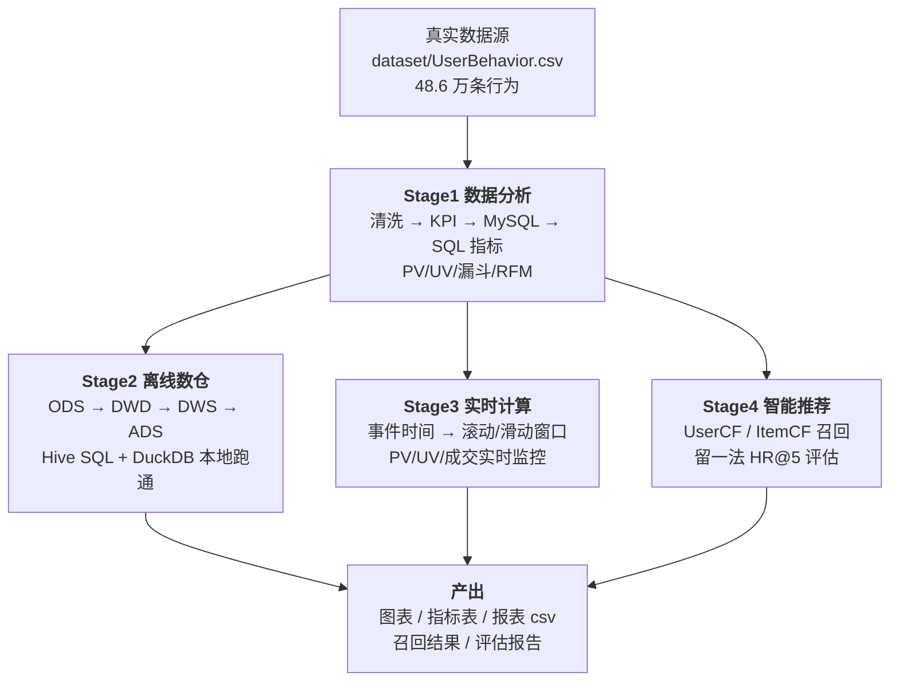

# 电商大数据学习项目 · ecommerce-bigdata-study

> 从 0 到 1 走完 **数据分析 → 离线数仓 → 实时计算 → 智能推荐** 全链路。
> 全部代码基于**真实电商行为数据**（48.6 万条淘宝用户行为），本机一条命令跑通，**不需要 Hadoop 集群**。

   

---

## 这份仓库是什么

一个可复现的电商大数据学习项目：用**同一份真实数据**，依次完成四个阶段的实战，
每个阶段都产出可运行的代码 + 可展示的结果 + 可讲清楚的分析结论，用来支撑简历项目与面试复盘。

和常见的"教程仓库"的区别：

| 常见问题 | 本仓库的做法 |
|---|---|
| 用手造的小样本数据，跑出的指标是假象 | 接入天池真实数据集 48.6 万条，购买率 2.57%（真实量级），不是 60% |
| 要求先搭 Hadoop/Hive 集群才能学 | **零集群即可跑通全部四层**：DuckDB 跑数仓、pandas 跑窗口计算、numpy 跑协同过滤 |
| 只有代码，没有结论 | 每个脚本末尾都有"分析解读"，每步都落盘可查的结果文件 |
| 推荐系统没有评估，无法证明有效 | 留一法 + HR@5 评估，并给出相对随机基线的提升倍数 |

---

## 数据集

| 项目 | 说明 |
|---|---|
| 名称 | 淘宝用户行为数据集（UserBehavior） |
| 来源 | 阿里云天池公开数据集子集，Flink 教程镜像 |
| 规模 | **485,730 条**真实行为 / 231,912 用户 / 275,489 商品 / 5,614 类目 |
| 时间 | 2017-11-26 01:00 ~ 10:00（双十一后第 3 周） |
| 字段 | user_id, item_id, category_id, behavior_type(pv/fav/cart/buy), timestamp |
| 大小 | 17.8 MB（已入库仓库，可直接用） |
| 详情 | [dataset/数据集说明.md](dataset/数据集说明.md) |

重新下载：`py -3.10 dataset/download_userbehavior.py`

---

## 架构总览



**生产环境对照**（学习时用本地等价实现，理解每一步在线上对应什么组件）：

| 阶段 | 本仓库实现（可跑） | 生产环境组件 |
|---|---|---|
| 数据分析 | pandas + MySQL | Python 脚本 / 调度平台 |
| 离线数仓 | Hive SQL + DuckDB 执行 | Hadoop + Hive + Sqoop + Azkaban |
| 实时计算 | pandas 窗口聚合 | Kafka + Flink / Spark Structured Streaming + Redis |
| 智能推荐 | numpy 协同过滤 | Spark MLlib(ALS) + 向量检索 + 排序模型 |

---

## 技术栈

| 类别 | 技术 |
|---|---|
| 语言 / 环境 | Python 3.10、Windows PowerShell |
| 数据处理 | pandas、numpy |
| 可视化 | matplotlib（中文字体 Microsoft YaHei） |
| 数据库 | MySQL 8.4（业务库）、DuckDB 1.5（嵌入式 OLAP） |
| 数仓 SQL | Hive SQL（生产口径）+ DuckDB SQL（本地等价实现） |
| 流式处理 | 手写窗口聚合（教学版）+ Flink SQL（集群版对照） |
| 推荐算法 | 协同过滤（UserCF / ItemCF）、余弦相似度、留一法评估 |

---

## 目录结构

```
ecommerce-bigdata-study/
├── README.md                      ← 本文件（项目总览）
├── requirements.txt               ← Python 依赖
├── run_pipeline.py                ← 一键跑通全链路（7 步）
├── dataset/                       ← 数据层
│   ├── UserBehavior.csv           ← 真实数据（48.6 万条）
│   ├── sample_behavior.csv        ← 10 条教学小样本（入门演示用）
│   ├── download_userbehavior.py   ← 数据下载脚本
│   ├── 数据集说明.md               ← 字段/规模/口径说明
│   └── clean_behavior.csv         ← 清洗产物（脚本生成，不入库）
├── stage1_data_analysis/          ← 阶段1：Python + SQL 数据分析
│   ├── README.md
│   ├── clean_real_data.py         ← 清洗（缺失值/枚举/时间范围/去重）
│   ├── real_data_kpi.py           ← 核心 KPI + 图表
│   ├── load_to_mysql.py           ← 数据入库（LOAD DATA）
│   ├── sql_analysis.sql           ← 6 组核心指标 SQL
│   ├── run_sql_analysis.py        ← 执行 SQL 并落盘结果
│   ├── sql_results.txt            ← 指标结果快照
│   ├── sample_demo/               ← 入门小样本演示（3 个脚本）
│   └── real_behavior_analysis.png ← 真实数据 KPI 图表
├── stage2_offline_dw/             ← 阶段2：离线数仓
│   ├── README.md
│   ├── 1_ods_user_behavior.sql    ← ODS 原始层（原样备份）
│   ├── 2_dwd_user_behavior.sql    ← DWD 明细层（清洗/转换/去重）
│   ├── 3_dws_user_behavior_metrics.sql  ← DWS 指标宽表
│   ├── 4_ads_user_behavior_report.sql   ← ADS 应用报表层
│   ├── run_local_dw.py            ← DuckDB 本地跑通四层
│   └── out_*.csv                  ← 四层产出（DWS/ADS 报表）
├── stage3_real_time/              ← 阶段3：实时计算
│   ├── README.md
│   ├── realtime_metrics.py        ← 窗口聚合 + 大屏图表
│   ├── flink_sql_realtime.sql     ← Flink SQL 集群版对照
│   ├── realtime_windows.csv       ← 窗口结果（109 个 5 分钟窗口）
│   └── realtime_metrics.png
├── stage4_recommend/              ← 阶段4：推荐系统
│   ├── README.md
│   ├── recommend_cf.py            ← UserCF / ItemCF + 评估
│   ├── evaluation.txt             ← 评估报告（HR@5）
│   ├── recommendations.csv        ← 召回结果表
│   └── hot_items.csv              ← 冷启动热门兜底
├── scripts/
│   └── start_mysql.ps1            ← 启动本地 MySQL
└── docs/                          ← 学习文档
    ├── README.md                  ← 文档索引
    ├── 学习计划v2.md               ← 12 周学习计划
    ├── 实操进度对照清单.md          ← 逐条进度对照
    └── notes/                     ← 每周学习笔记
```

---

## 快速开始

### 0. 环境要求

- Python 3.10（Windows 下用 `py -3.10` 调用）
- MySQL 8.4（只有阶段1 的入库/SQL 两步需要，其余步骤不依赖）
- 依赖安装：

```powershell
py -3.10 -m pip install -r requirements.txt -i https://mirrors.aliyun.com/pypi/simple/
```

> 国内镜像建议用阿里云：本机实测清华镜像会被系统代理拦截（403），豆瓣镜像已废弃。

### 1. 一键跑通全链路（约 20 秒）

```powershell
# 先启动 MySQL（只有第 4、5 步需要）
.\scripts\start_mysql.ps1

# 全流程：清洗 → KPI → 数仓四层 → 入库 → SQL 指标 → 实时窗口 → 推荐评估
py -3.10 run_pipeline.py
```

跳过 MySQL 相关步骤：`py -3.10 run_pipeline.py --skip-mysql`
单跑某一步：`py -3.10 run_pipeline.py --only 6`

### 2. 分步运行

| 步骤 | 命令 | 产出 |
|---|---|---|
| 数据清洗 | `py -3.10 stage1_data_analysis/clean_real_data.py` | `dataset/clean_behavior.csv` + 质量报告 |
| KPI 与图表 | `py -3.10 stage1_data_analysis/real_data_kpi.py` | `real_behavior_analysis.png` |
| 离线数仓四层 | `py -3.10 stage2_offline_dw/run_local_dw.py` | `out_dws_metrics.csv` 等 4 个 |
| 导入 MySQL | `py -3.10 stage1_data_analysis/load_to_mysql.py` | 表 `user_behavior`（48.6 万行）|
| SQL 指标分析 | `py -3.10 stage1_data_analysis/run_sql_analysis.py` | `sql_results.txt` |
| 实时窗口计算 | `py -3.10 stage3_real_time/realtime_metrics.py` | `realtime_windows.csv` + 图 |
| 推荐召回与评估 | `py -3.10 stage4_recommend/recommend_cf.py` | `evaluation.txt` + 2 个 csv |

所有脚本都**不依赖运行目录**（内部按脚本位置解析路径），在任何目录下执行都可以。

---

## 各阶段成果

### Stage1 · 数据分析（[详细说明](stage1_data_analysis/README.md)）

**实测指标（真实数据 2017-11-26 单日）**

| 指标 | 数值 |
|---|---|
| PV / UV | 434,349 / 231,912 |
| 收藏 / 加购 / 购买次数 | 14,396 / 25,824 / 11,161 |
| 浏览 → 加购转化率 | 5.95% |
| 浏览 → 购买转化率 | **2.57%** |
| 加购 → 购买转化率 | 43.22% |
| 用户漏斗（独立用户口径） | 215,662 浏览 → 34,687 有意向 → 10,587 购买 |
| 流量高峰小时 | 07~08 点（52,296 PV） |
| RFM 分层 | 一般发展客户 75.7%、一般挽留 19.4%、重要价值 4.1% |

图表：`real_behavior_analysis.png`（时段 PV/UV 趋势 + 真实漏斗）

### Stage2 · 离线数仓（[详细说明](stage2_offline_dw/README.md)）

四层架构，Hive SQL 写生产口径，`run_local_dw.py` 用 DuckDB 在本机跑通同样逻辑：

- **ODS**：原样装载 485,730 行（不做任何处理，等于数据备份）
- **DWD**：类型规整 + 合法枚举过滤 + 窗口函数去重 + 派生 `datetime`/`dt`/`behavior_name`
- **DWS**：按天一行指标宽表（PV/UV/收藏/加购/购买 + 三级转化率）
- **ADS**：三张业务报表（小时流量、类目 TOP、转化漏斗）

产出：`out_dws_metrics.csv`、`out_ads_hourly.csv`、`out_ads_category_top.csv`、`out_ads_funnel.csv`

### Stage3 · 实时计算（[详细说明](stage3_real_time/README.md)）

- 把数据按事件时间当消息流处理，聚合 **109 个 5 分钟滚动窗口**：PV / UV / 购买量
- 另做 15 分钟窗口、5 分钟步长的**滑动窗口对照**（说明两种窗口的取舍）
- 流量峰值窗口 08:45~08:50（PV 4,598 / UV 4,397），成交最密集窗口 05:55~06:00（137 次购买）
- `flink_sql_realtime.sql` 给出集群版写法（Kafka 源表、TUMBLE 窗口、watermark 处理乱序）

### Stage4 · 推荐系统（[详细说明](stage4_recommend/README.md)）

- 实现 **UserCF**（用户相似度）与 **ItemCF**（商品相似度）双路召回
- 建模矩阵：8,000 用户 × 3,868 商品（稀疏度 99.94%），说明"为什么必须抽样"
- **离线评估（留一法）**：参与评估用户 2,382

| 算法 | HR@5 | 相对随机基线 |
|---|---|---|
| ItemCF | 1.89% | **14.6 倍** |
| UserCF | 1.89% | **14.6 倍** |
| 随机推荐 | 0.1293% | 1× |

- 冷启动方案：`hot_items.csv`（购买/加购最热 TOP20 兜底）

---

## 项目亮点与踩坑记录

**1. 真实数据 > 漂亮数字**
教学样本里购买率 60%（假象）；真实数据 2.57%。数据一换，漏斗形态、时段规律、
类目差异全都"活"了过来——这也是面试官最容易追问的点：你的指标口径是什么、数据从哪来。

**2. 事务陷阱：导入 48 万条数据后查表是空的**
`pymysql` 默认 `autocommit=0`，`LOAD DATA` 在 InnoDB 里是事务性的，不 `commit`
连接一关就全部回滚。第一个连接里 `COUNT(*)` 还能看到 48 万（那是未提交事务里的数据），
换个连接就没了。教训：**验证数据必须开新连接**。

**3. 时区陷阱：数仓时间整体偏移 8 小时**
DuckDB 的 `to_timestamp()` 返回 `TIMESTAMP WITH TIME ZONE`，会按会话时区渲染，
算出来的小时分布整体 +8 小时；改用 `epoch_ms()` 才与源文件一致。
数仓里任何时间派生字段都应该做一次"与源文件对比"的校验，否则指标会**静默错位**——
量级看着正常，只是时间整体平移了，比报错更难发现。

**4. 不评估的模型等于没做**
协同过滤在稀疏数据上"看起来"能出结果，但 HR@5 只有 1.89%。不跟随机基线（0.1293%）
对比，你根本不知道模型有没有用——14.6 倍提升才是能写进简历的结论。

**5. 环境问题也是工程能力**
豆瓣镜像已废弃、清华镜像被本机代理 403、注册 MySQL 服务需要管理员权限——
这些都在 [docs/notes](docs/notes/) 里有记录，实际工作中同类问题占比不低。

---

## 学习进度与路线

| 阶段 | 内容 | 状态 |
|---|---|---|
| 周0 | 环境搭建 + 真实数据接入 | ✅ 完成 |
| 周1 | 数据清洗 + 质量报告 | ✅ 完成 |
| 周2 | MySQL 入库 + 核心指标 SQL（PV/UV/漏斗/RFM） | ✅ 完成 |
| 周3 | Streamlit 交互大屏 + stage1 README | ⏳ 下一步 |
| 周4-6 | 离线数仓建模文档 + 虚拟机集群实操（Hive/Sqoop/Azkaban） | 🔶 SQL 与本地跑通已完成 |
| 周7-9 | Kafka + Spark Structured Streaming + ECharts 大屏 | 🔶 窗口逻辑与 Flink SQL 已有 |
| 周10-12 | 特征工程 + ALS + 完整评估 + 简历包装 | 🔶 CF 原型与评估已完成 |

完整计划见 [docs/学习计划v2.md](docs/学习计划v2.md)，逐条进度对照见 [docs/实操进度对照清单.md](docs/实操进度对照清单.md)。

---

## 常见问题

**Q：不装 MySQL 能跑吗？**
能。`py -3.10 run_pipeline.py --skip-mysql` 会跳过入库与 SQL 两步，其余五步照常。
数仓部分可用 DuckDB 完全替代 MySQL 的验证作用。

**Q：Windows 终端输出中文乱码？**
脚本本身以 UTF-8 打印；若用 PowerShell 重定向（`>`）会产生 UTF-16 文件，
建议设置 `$env:PYTHONIOENCODING='utf-8'`，或直接用 `run_pipeline.py`（已处理编码）。

**Q：pip 装不上包？**
换阿里云镜像：`-i https://mirrors.aliyun.com/pypi/simple/`（本机实测清华镜像被代理拦截）。

**Q：为什么 `clean_behavior.csv` 没有提交到仓库？**
它是清洗脚本的产物（28MB），一条命令即可复现，已在 `.gitignore` 中排除。

---

## 提交规范

- 提交信息格式：`阶段-周次-核心内容`，例如 `stage1-week2: MySQL数据入库与核心指标SQL统计`
- 每个功能模块单独 commit，禁止一次性提交全量代码
- 数据、脚本、文档、图表分目录存放；每周学习笔记写入 `docs/notes/weekN.md`

## 许可

学习项目，代码可自由使用。数据集版权归阿里云天池所有，仅用于学习研究。
