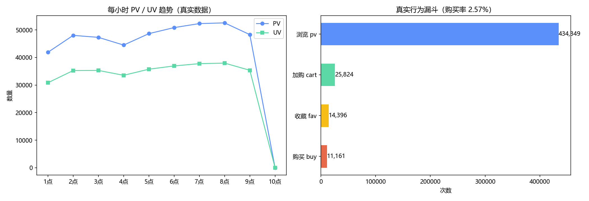

# Stage1 · Python + SQL 电商数据分析

数据分析阶段的完整实现：**清洗 → KPI 计算 → MySQL 入库 → SQL 指标 → 可视化 → 交互大屏**。
所有脚本都用真实数据（48.6 万条淘宝用户行为），可在本机直接运行。

---

## 项目简介

用最通用的工具链（pandas + MySQL）完成电商数据分析的完整流程：
把原始行为日志变成能支撑决策的指标体系。这一阶段解决的三个问题：

1. **数据能不能用**——清洗流程与质量报告（缺失值、非法枚举、时间范围、重复行）
2. **业务发生了什么**——PV/UV、转化漏斗、时段规律、类目热度、用户分层
3. **口径怎么定义**——次数口径 vs 独立用户口径、无金额字段时 GMV/RFM 的替代方案

## 技术栈

| 用途 | 技术 |
|---|---|
| 数据处理 | Python 3.10、pandas |
| 数据存储 | MySQL 8.4（`LOAD DATA LOCAL INFILE` 批量导入） |
| 指标计算 | SQL（条件聚合、CTE、窗口函数、RFM 打分） |
| 可视化 | matplotlib（静态图表）、Streamlit + Altair（交互式大屏） |

## 环境要求

```powershell
# 1. 依赖
py -3.10 -m pip install pandas numpy matplotlib pymysql -i https://mirrors.aliyun.com/pypi/simple/

# 2. MySQL（仅 load_to_mysql.py 与 run_sql_analysis.py 需要）
..\scripts\start_mysql.ps1     # 启动本机 MySQL 8.4（root 空密码，仅本机监听）
```

## 数据集来源

`dataset/UserBehavior.csv` —— 阿里云天池《淘宝用户行为数据集》子集
（485,730 条 / 231,912 用户 / 275,489 商品 / 2017-11-26 单日 10 小时），
详见 [../dataset/数据集说明.md](../dataset/数据集说明.md)。
缺失时执行：`py -3.10 ../dataset/download_userbehavior.py`

## 部署运行步骤

```powershell
# ① 数据清洗 → dataset/clean_behavior.csv（+ 质量报告）
py -3.10 clean_real_data.py

# ② 核心 KPI 与图表 → real_behavior_analysis.png
py -3.10 real_data_kpi.py

# ③ 数据入库（自动建库建表 + LOAD DATA + 新连接校验）
powershell -File ..\scripts\start_mysql.ps1   # 若 MySQL 未启动
py -3.10 load_to_mysql.py

# ④ SQL 指标分析（执行 sql_analysis.sql 全部查询）→ sql_results.txt
py -3.10 run_sql_analysis.py

# ⑤ 交互式数据大屏 → http://localhost:8501
py -3.10 -m streamlit run dashboard.py
```

一键跑完前四步（含其他阶段）：`py -3.10 ..\run_pipeline.py`

## 数据大屏（dashboard.py）

Streamlit 交互式大屏，**双数据源**：优先读 MySQL 的 `user_behavior` 表，
连不上自动回退 `dataset/clean_behavior.csv` —— 没装 MySQL 也能直接看。

**侧边栏联动筛选**：时段范围、行为类型、类目 TOP N —— 指标卡与全部图表实时联动。

| 模块 | 内容 |
|---|---|
| 指标卡 | PV / UV / 收藏 / 加购 / 购买 + 两级转化率，delta 显示"当前筛选 vs 全量" |
| ① 小时流量趋势 | PV、UV 双线 |
| ② 行为分布 | 浏览/收藏/加购/购买占比（环形图，固定配色顺序） |
| ③ 转化漏斗 | 独立用户口径，标注每层留存率 |
| ④ 小时 × 行为构成 | 堆积柱，看时段内的行为结构 |
| ⑤ 类目热度 TOP N | 按 PV 排序，颜色深浅 = 购买率（越深越高） |
| ⑥ RFM 八分层 | 重要客户红色、一般客户浅蓝 |
| 明细区 | 筛选后明细预览（限 1000 行）+ 一键导出 CSV |

**一致性保障**：大屏指标口径与 `sql_analysis.sql` 逐行对齐（PV/UV/加购/购买 + RFM 六层
全部一致），并用 Streamlit 官方 `AppTest` 框架做了 UI 与交互回归（0 异常）。

## 核心功能

| 文件 | 职责 |
|---|---|
| `clean_real_data.py` | 四步清洗：缺失值 → 行为枚举合法性 → 时间范围 → 全字段去重，输出质量报告 |
| `real_data_kpi.py` | PV/UV/收藏/加购/购买、三级转化率、时段趋势与漏斗图 |
| `load_to_mysql.py` | 建库建表（3 个查询索引）+ `LOAD DATA` 批量导入 + **另开连接**校验行数 |
| `sql_analysis.sql` | 6 组指标：整体核心指标、小时流量、用户漏斗、类目 TOP10、购买力 TOP10、RFM 八分层；末尾附"有金额数据时的 GMV/客单价模板" |
| `run_sql_analysis.py` | 解析并执行 `sql_analysis.sql`（SQL 只有一份，避免双份维护），结果落盘 |
| `dashboard.py` | Streamlit 交互大屏：6 模块 + 侧边栏联动筛选 + 明细导出，双数据源容错 |
| `sample_demo/` | 入门演示（10 条小样本）：`read_data.py`、`calculate_kpi.py`、`plot_behavior.py` |

## 效果截图



左：每小时 PV/UV 趋势（凌晨低谷、早高峰启动）；右：真实行为漏斗（购买率 2.57%）

## 关键结果

| 指标 | 数值 | 说明 |
|---|---|---|
| PV / UV | 434,349 / 231,912 | 10 小时窗口内 |
| 浏览 → 购买转化率 | 2.57% | 次数口径 |
| 用户漏斗 | 215,662 → 34,687 → 10,587 | 独立用户口径，购买用户占浏览用户 4.91% |
| 流量高峰 | 07~08 点 | 52,296 PV / 37,763 UV |
| 类目 TOP1 | 4756105（21,923 PV） | 但购买率仅 0.70%——"浏览高 ≠ 买得多" |
| RFM 主体人群 | 一般发展客户 75.7% | 运营含义：提客单，而不是继续拉新 |

## 技术亮点

1. **口径显式化**：`UserBehavior` 没有金额字段，脚本里明确写出"GMV/客单价无法计算，
   RFM 的 M 用购买商品数替代"，并给出换数据集时的替换写法——数据分析师的基本素养是口径透明。
2. **SQL 单一来源**：`run_sql_analysis.py` 直接解析 `sql_analysis.sql`，避免"文件里一份、脚本里一份"的漂移。
3. **入库后用新连接验证**：`LOAD DATA` 不 `commit` 会全部回滚，而旧连接里还能看到数据（未提交事务），
   所以校验必须换连接——这是一个真实的、踩过的坑。
4. **大表导入性能**：48.6 万条用 `LOAD DATA LOCAL INFILE` 约 5 秒（逐条 INSERT 需要几分钟）。
5. **大屏用官方测试框架做回归**：`streamlit.testing.v1.AppTest` 能真实执行页面脚本并模拟筛选交互，
   适合在没有浏览器的情况下验证"页面不报错、筛选真的联动"——比手点更可靠，也可以放进 CI。
6. **指标口径跨实现对齐**：大屏的 RFM 与 SQL 完全一致（六层逐行核对），
   关键是发现并统一了"小数小时 vs 整点截断"的差异。

## 常见问题

- **`can't open file 'calculate_kpi.py'`**：该脚本已迁移到 `sample_demo/`（小样本演示用），
  真实数据请用 `real_data_kpi.py`。
- **连接 MySQL 失败**：执行 `..\scripts\start_mysql.ps1`；Windows 服务需管理员权限，脚本用前台进程代替。
  大屏不依赖 MySQL（会自动回退 CSV）。
- **加购→购买转化率 > 100%**：只在 10 条教学样本里会出现（购买行为没有对应加购记录），真实数据为 43.22%。
- **Streamlit 装不上/启动慢**：`py -3.10 -m pip install streamlit -i https://mirrors.aliyun.com/pypi/simple/`，
  首次启动需解压前端资源，约 2~5 秒。
