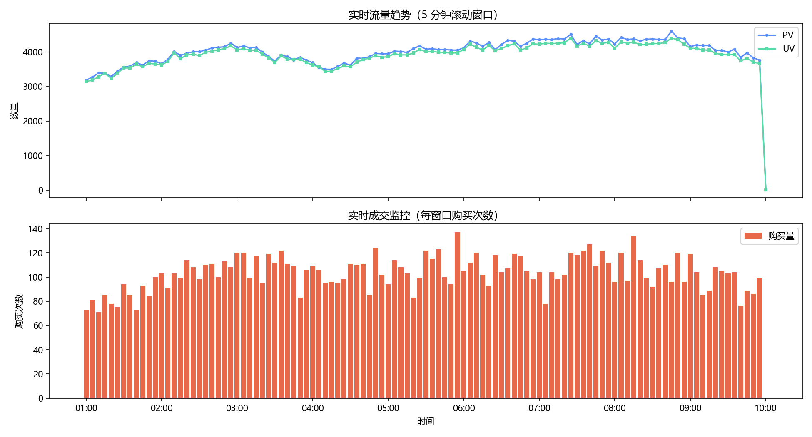

# Stage3 · Kafka + 流式实时计算

实时计算的本地可运行实现：把行为数据当作消息流，按**窗口**聚合实时指标。
配套 `flink_sql_realtime.sql` 给出集群版写法（Kafka 源表 + TUMBLE 窗口 + watermark）。

---

## 项目简介

实时计算与离线计算的**数学逻辑完全相同，区别只在"何时算"**：

| | 离线（Stage2） | 实时（本阶段） |
|---|---|---|
| 何时算 | 攒一天数据，T+1 凌晨批量跑 | 数据到一条算一条，按窗口分钟级出结果 |
| 回答的问题 | "昨天全天怎么样" | "现在这一刻怎么样" |
| 典型用途 | 日报、复盘、考核 | 大屏、告警、实时推荐、风控 |

本脚本用 pandas 实现**事件时间窗口聚合**（等价于 Flink 的 `TUMBLE`），
并对比滚动窗口与滑动窗口的差异，产出实时大屏样式的图表。

## 技术栈

| 用途 | 技术 |
|---|---|
| 流式模拟（本地） | Python 3.10、pandas（按事件时间分桶聚合） |
| 流式计算（生产） | Kafka + Flink / Spark Structured Streaming |
| 结果存储（生产） | Redis / MySQL（大屏高频读取） |
| 可视化 | matplotlib（大屏样式折线 + 柱状） |

## 环境要求

```powershell
py -3.10 -m pip install pandas matplotlib -i https://mirrors.aliyun.com/pypi/simple/
```

无需 Kafka/Flink：脚本用本地数据模拟消息流，`flink_sql_realtime.sql` 供集群环境参考。

## 数据集来源

`../dataset/clean_behavior.csv`（485,730 条真实行为，2017-11-26 01:00~10:00，共约 540 分钟）

## 部署运行步骤

```powershell
py -3.10 ..\stage1_data_analysis\clean_real_data.py   # 前置：生成清洗数据（如尚未生成）
py -3.10 realtime_metrics.py                          # 窗口聚合 + 图表 + 窗口结果落表
```

## 核心功能

| 功能 | 说明 |
|---|---|
| 滚动窗口聚合 | 5 分钟 TUMBLE 窗口，粒度 109 个，统计 PV / UV / 加购 / 购买 |
| 滑动窗口对照 | 15 分钟窗口、5 分钟步长，曲线更平滑（但同一事件会被多个窗口重复统计） |
| 窗口结果落表 | `realtime_windows.csv`，对应线上"写 Redis/MySQL 结果表" |
| 实时大屏图表 | `realtime_metrics.png`：上半流量趋势折线，下半成交监控柱状 |
| 集群版对照 | `flink_sql_realtime.sql`：Kafka 源表 DDL、窗口 TVF、watermark、4 个面试常问点注释 |

## 效果截图



## 关键结果

| 指标 | 数值 |
|---|---|
| 窗口数量 | 109 个（5 分钟滚动窗口，覆盖 01:00~10:05） |
| 流量峰值窗口 | 08:45~08:50（PV 4,598 / UV 4,397） |
| 成交最密集窗口 | 05:55~06:00（购买 137 次） |
| 单窗口购买量区间 | 约 70 ~ 140 次 |

窗口结果示例（`realtime_windows.csv`）：

```
window        pv    uv   cart  buy
01:00~01:05  3179  3142    191   73
...
08:45~08:50  4598  4397    245   96
```

## 技术亮点

1. **事件时间意识**：先按 `datetime` 排序再分桶——流式数据必须按事件时间处理，
   否则乱序到达的数据会被算进错误的窗口（生产环境靠 watermark 解决）。
2. **两种窗口的取舍讲清楚**：滚动窗口不重叠、结果可相加（适合对账）；
   滑动窗口重叠统计、曲线平滑（适合大屏展示）——但**滑动窗口的结果不能相加**。
3. **组件映射明确**：脚本里每一步都标注了线上对应的组件（deque→Kafka、
   groupby 窗口→Flink、结果 csv→Redis、图表→ECharts），学到的是架构而不是 API。
4. **诚实说明边界**：本脚本回避了真实流式的两个难点——乱序数据（watermark）与
   迟到数据（allowed lateness + 侧输出流补算），这两点在 `flink_sql_realtime.sql` 注释里给出生产写法。

## 常见问题

- **窗口数为什么是 109 而不是 108**：数据末尾 10:00 之后还有 14 条记录，落在最后一个不完整窗口里。
- **如何改成"按用户维度"的实时指标**：把 `groupby("window_start")` 换成
  `groupby(["window_start", "user_id"])` 即可，注意窗口内的去重字段（UV）需要用 `nunique`。
- **为什么用 pandas 而不是真上 Flink**：学习阶段先理解窗口的语义与口径，避免把时间消耗在集群与
  Connector 调试上；`flink_sql_realtime.sql` 保留了可直接迁移的写法。
